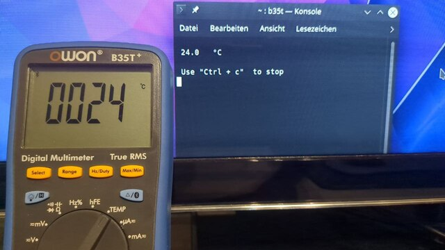

# Multimeter OWON B35T+

## Description
Just a small tool to show the values from the OWON B35T+ Multimeter.

## Installation

### Requirements
  - `bulez` especially `gatttool`
  - `python3`

Use `sudo apt install bluez` for installing `gatttool`.
Then download the deb package and use `sudo dpkg -i <package-name>` for installing.

To remove the program, do the following: `sudo dpkg --purge python3-b35t`

## Usage
Find the MAC address of the B35T+ by running `sudo hcitool lescan`
and looking for '<MAC ADDRESS> BDM'

Hint: If it is not visible, 
keep the button with the Bluetooth symbol on the Multimeter pressed for 3 seconds.

Usage example:
`b35t -m '34:15:13:D1:00:80'`

## Build
If you want to build the Debian package yourself you have to use this command:
`python3 setup.py --command-packages=stdeb.command bdist_deb`

## Protocol 
I have written down a few elements of the protocol [hear](protocol.md).

## Thanks to
  - [b35t-reader by granzscientific](https://github.com/granzscientific/b35t-reader) he creates a version for a old OWON Multimeter.
  - [owonb35 by DeanCording](https://github.com/DeanCording/owonb35) he creates a C version and reverse engineer protocol of the Multimeter. I could not get them to run even with his help.
